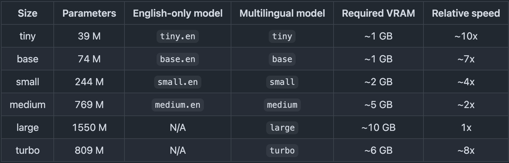

# SafeSound

SafeSound is a tool that processes audio files and exports a version with the profanity muted.

## How it works

SafeSound uses [OpenAI's Whisper model](https://github.com/openai/whisper) to transcribe audio files. Then, it uses [Gentle: Forced Aligner](https://github.com/strob/gentle) to precisely sync the transcription with the audio. Finally, a custom Python script mutes profanity based on the aligned transcription and exports a cleaned audio file.

## Requirements

- Python 3.10
- Docker (for running Gentle, the forced aligner)
- ffmpeg (for audio processing)

> ⚠️ **Note:** SafeSound has only been tested on macOS. Windows and Linux may work but are not guaranteed. 

## Installation

1. Install Python 3.10 (recommended: [pyenv](https://github.com/pyenv/pyenv)):
    ```sh
    pyenv install 3.10
    pyenv local 3.10
    $(pyenv which python3) -m venv venv
    source venv/bin/activate
    ```
2. Install dependencies:
    ```sh
    pip install -r requirements.txt
    ```
3. Ensure `ffmpeg` is installed and available in your PATH.

## Usage

The main entry point is [`safe_sound.py`](safe_sound.py):

```sh
python3 safe_sound.py <file_to_edit>
```

You can also process multiple files by typing:

```
python3 safe_sound.py <file1> <file2> etc...
```

Or, you can do a whole directory:

```
python3 safe_sound.py <directory_name>/*
```

---
> ⚠️ **Note:** By default, SafeSound will use Whisper's `base` model. You can change this in the `.env` file. Here are the available models:



You can modify the `profanity.txt` file to customize the word list to your preference. It allows for individual words or entire phrases.

> ⚠️ **Warning:** `profanity.txt` is NSFW as all the words are explicitly laid out.

## Development

- Entry point: [`safe_sound.py`](safe_sound.py)
- Key modules:
    - [`loading.py`](loading.py): Handles progress bar.
    - [`mute_profanity.py`](mute_profanity.py): Mutes profanities in audio.
    - [`gentle.py`](gentle.py): Integrates with Gentle for forced alignment.
    - [`transcriber.py`](transcriber.py): Handles transcription tasks.

## Contributing

See [`CONTRIBUTING.md`](CONTRIBUTING.md) for guidelines.

## License

[MIT](LICENSE)